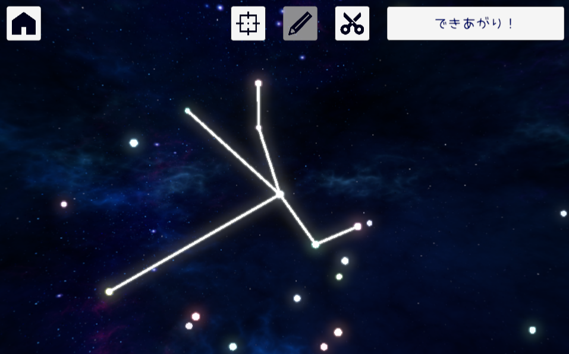
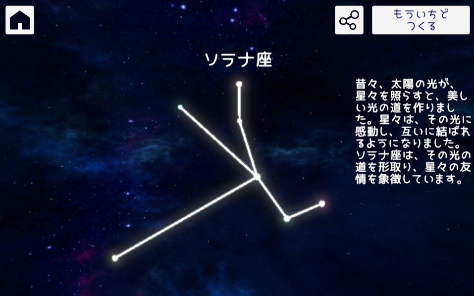

# カジュアルゲーム「星座づくり」

## 実際に遊べるページ

- 開発環境
  - https://ushibutatory.github.io/game-stella_generator-pages/

## なにこれ

- ランダムに表示される星をつないで、星座の形を作ります。
- 作成した星座の形をもとに、AI が星座の名前を考えます。
- 3 歳の娘が遊ぶ想定なので、テキストは敢えてひらがなを多用しています。
  - AI が生成するテキストには難しい表現が含まれることがあります。

## 使わせていただいたアセット、素材など

- BGM
  - [かまタマゴ | https://kamatamago.com](https://kamatamago.com)
    - ジムノペディ第 1 番 / エリック・サティ
- SE
  - Casual SoundFX Pack
  - Free UI Click Sound Effects Pack
- フォント
  - JK丸ゴシック
    - [ふぉんときゅーとがーる。 | https://font.cutegirl.jp](https://font.cutegirl.jp)
- 背景
  - SkySeries Freebie
- アイコン
  - [https://icooon-mono.com/](https://icooon-mono.com/)
- 他
  - UniTask
    - https://github.com/Cysharp/UniTask
  - R3
    - https://github.com/Cysharp/R3
  - MessagePipe
    - https://github.com/Cysharp/MessagePipe
  - DOTWeen Pro
  - Unity File Extensions
    - https://listwon.itch.io/unityfileextensions
  - Odin Inspector
    - https://odininspector.com/
